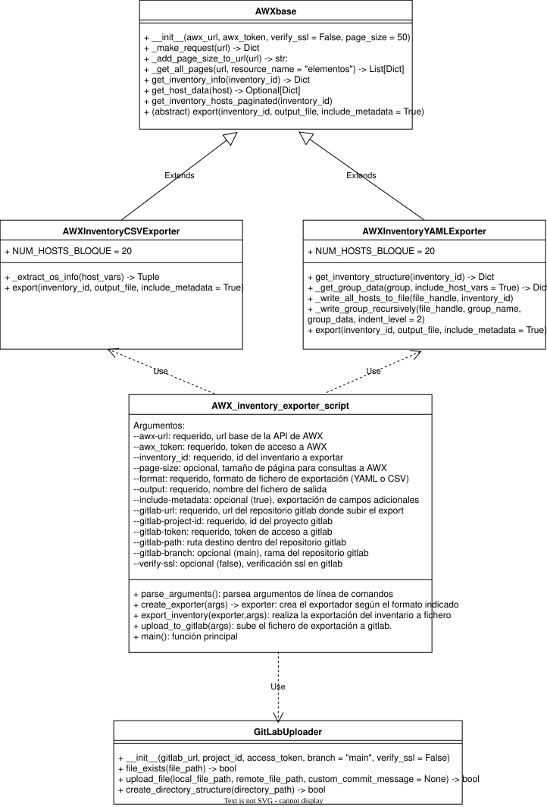

# EXPORTADOR DE INVENTARIOS AWX EN PYTHON

Exporta un inventario de AWX a ficheros CSV o YAML y lo sube a GitLab.

## DIAGRAMA DE CLASES




## Estructura de archivos del proyecto

```text
awx_exporter_package/
├── docs/
│   ├── Exportador de Inventarios AWX - Descripción.odt
│   ├── AWX_inventory_exporter.drawio
│   └── AWX_inventory_exporter.drawio.svg
├── README.md
├── __init__.py
├── config.py
├── awx_base.py
├── gitlab_uploader.py
├── awx_csv_exporter.py
├── awx_yaml_exporter.py
└── AWX_inventory_export_script.py
```

## DESCRIPCIÓN DE LAS CLASES

### AWXBase - Funcionalidad común

- Conexión y autenticación con AWX
- Manejo de paginación
- Peticiones HTTP con manejo de errores
- Obtención de información básica de inventarios y hosts

### GitLabUploader - Subida a GitLab

- Manejo de archivos en GitLab (crear/actualizar)
- Verificación de existencia de archivos
- Codificación Base64 y mensajes de commit

### AWXInventoryCSVExporter - Exportación a CSV

- Hereda de `AWXBase`
- Extracción específica de información de SO
- Generación de CSV con metadatos opcionales

### AWXInventoryYAMLExporter - Exportación a YAML

- Hereda de `AWXBase`
- Generación de inventarios compatibles con Ansible
- Escritura paginada para optimizar memoria

### Scripts principales

- Manejo de argumentos específicos para cada caso de uso
- Validación y orquestación de las clases

## USO

Los scripts pueden ejecutarse directamente o importar las clases para uso programático.

### Uso programático

```python
from awx_csv_exporter import AWXInventoryCSVExporter
from gitlab_uploader import GitLabUploader

exporter = AWXInventoryCSVExporter(awx_url, token)
uploader = GitLabUploader(gitlab_url, project_id, token)
```