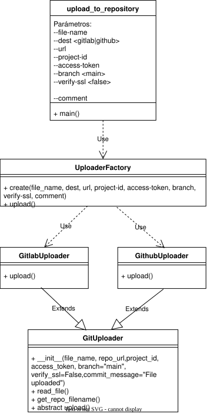

# UTILIDAD PARA SUBIR FICHEROS A REPOSITORIOS GITLAB/GITHUB

Sube un archivo a un repositorio Gitlab o Github.

## REQUISITOS

Necesita ser ejecutado en un entorno de ejecución en el que estén instaladas las siguientes librerías:

- requests>=2.32.0 o superior

## Estructura de archivos del proyecto

```text
git_uploader/
├── docs/
│   ├── git_uploader.drawio
│   └── git_uploader.drawio.svg
├── uploaders/
│   ├── __init__.py
│   ├── base.py
│   ├── factory.py
│   ├── github.py
│   └── gitlab.py
├── README.md
├── requirements.txt
└── upload_to_repository.py
```

## DIAGRAMA DE CLASES




## DESCRIPCIÓN DE LAS CLASES Y PAQUETES

### GitUploader (uploaders/base.py)

Clase base común que actúa como contrato para todos los uploaders. Esta clase base proporciona el método abstracto upload que implementarán los uploaders de los distintos tipos de repositorio.

### GitlabUploader (uploaders/gitlab.py)

Clase que implementa el uploader de Gitlab.

### GithubUploader (uploaders/github.py)

Clase que implementa el uploader de Github.

### UploaderFactory (uploaders/factory.py)

Clase factoría para crear instancias de los uploaders según el destino (tipo de repositorio) especificado.

### Script principal (upload_to_repository)

Programa principal que realiza la subida de un fichero al repositorio creando el uploader correspondiente.

## USO

El programa principal puede ser llamado directamente.

```sh
python3 upload_to_repository.py 
            --file-name <nombre>
            --dest <gitlab|github> 
            --url <repository URL>
            --project-id <project-id>
            --access-token <repository access token>
            --branch <repository branch>
            --verify-ssl <verify-ssl>
            --comment <comentario> 
```

### Descripción de los parámetros:
- file-name: ruta/fichero a subir al repositorio
- dest: repositorio destino (gitlab o github)
- url: url del repositorio
- project-id: identificador del proyecto al que se subirá el fichero
- access-token: token de acceso para autenticación en el repositorio
- branch: rama del proyecto al que se subirá el fichero, por defecto main
- verify-ssl: bandera que indica si se debe verificar certificados, por defecto false
- comment: comentario que se asociará al commit del fichero.

