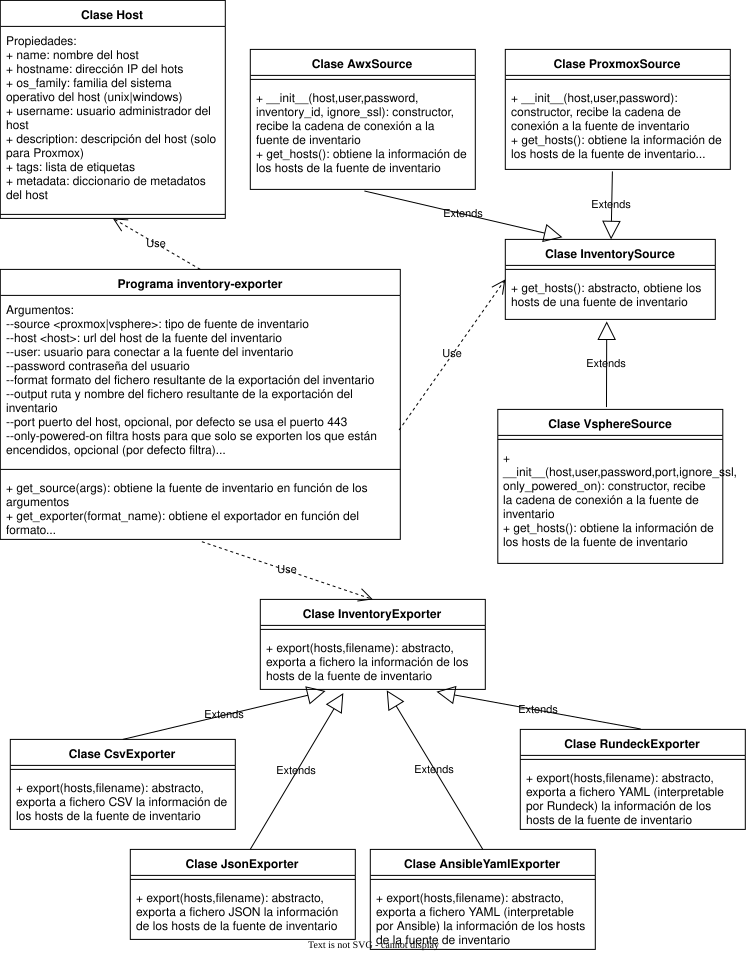

# EXPORTADOR GENÉRICO DE INVENTARIOS 

Crea un inventario de hosts usando como fuentes VMware vSphere o Proxmox y lo expporta a ficheros CSV, JSON o YAML (con formato apto para Ansible o Rundeck).

## REQUISITOS

El exportador necesita ser ejecutado en un entorno de ejecución en el que estén instaladas las siguientes librerías:

- pyvmomi 9.0 o superior.
- requests 2.31 o superior.
- PyYAML 6.0 o superior.
- urllib3 2.0 o superior.

## Estructura de archivos del proyecto

```text
inventory_exporter/
├── docs/
│   ├── Inventario-mapeo_de_campos.ods
│   ├── inventory_exporter.drawio
│   └── inventory_exporter.drawio.svg
├── exporters/
│   ├── base.py
│   ├── ansible_yaml_exporter.py
│   ├── csv_exporter.py
│   ├── json_exporter.py
│   └── rundeck_exporter.py
├── models/
│   └── host.py
├── sources/
│   ├── base.py
│   ├── proxmox.py
│   └── vsphere.py
├── README.md
├── requirements.txt
├── .gitignore
├── main.sh
└── inventory-exporter.py
```

## DIAGRAMA DE CLASES




## DESCRIPCIÓN DE LAS CLASES Y PAQUETES

### exporters

Contiene las clases que implementan los exportadores a distintos formatos (csv, json, ansible_yaml, rundeck) y la clase base común que actúa como contrato de los exportadores. Esta clase base proporciona el método abstracto export que implementarán los exportadores a los distintos formatos.


### models

Contiene la clase Host que recoge la información exportable de un host.


### sources

Clases que implementan el acceso a las fuentes de inventario y la obtención de la información exportable de los hosts. Contiene las siguientes clases:

- InventorySource (base.py): clase base para todas las fuentes de inventario. Define la interfaz para obtener hosts de una fuente.
- ProxmoxSource: clase de fuente de inventario de Proxmox.
- VsphereSource: clase de fuente de inventario de VMware vSphere.

Nota: para más información sobre los metadatos exportados de los hosts, ver 

### Scrips principales

- main.sh: wrapper bash para lanzar el programa principal inventory-exporter.py.
- inventory-exporter.py: programa principal.

## USO

El programa principal puede ser llamado directamente o a través del wrapper.

### Uso del wrapper main.sh

```sh
    ./main.sh --source <proxmox|vsphere>
              --host <host>
              --user <usuario>
              --password <password>
              --format <rundeck|csv|ansible|json> 
              --output <fichero>
              [--port <puerto>]
              [--only-powered-on]
              [--ignore-ssl]
```

### Uso del programa inventory-exporter.py

```sh
python3 inventory-exporter.py 
            --source <proxmox|vsphere> 
            --host <host>
            --user <usuario>
            --password <password>
            --format <rundeck|csv|ansible|json> 
            --output <fichero>
            [--port <puerto>]
            [--only-powered-on]
            [--ignore-ssl]
```

### Descripción de los parámetros:
- source indica el tipo de fuente del inventario
- host url del host de fuente del inventario
- user usuario para conectar a la fuente del inventario
- password contraseña del usuario
- format formato del fichero resultante de la exportación del inventario
- output ruta y nombre del fichero resultante de la exportación del inventario
- port puerto del host, opcional, por defecto se usa el puerto 443
- only-powered-on filtra hosts para que solo se exporten los que están encendidos, opcional (por defecto filtra)
- ignore-ssl ignora ssl para la conexión a la fuente (por defecto ignora )

